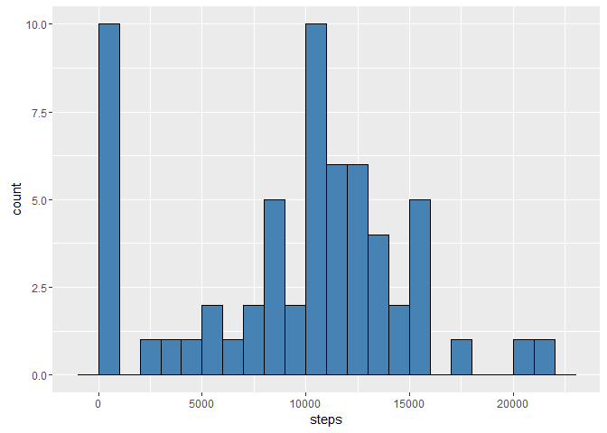
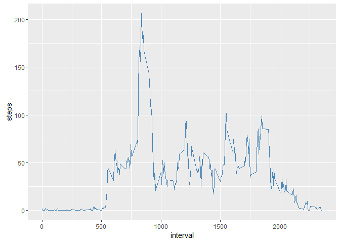
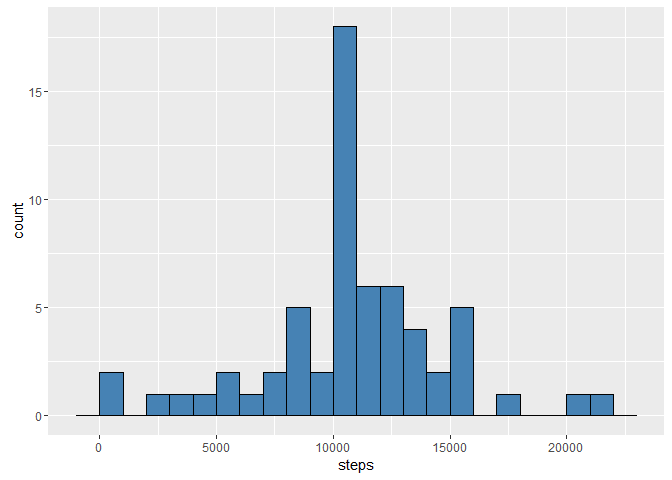
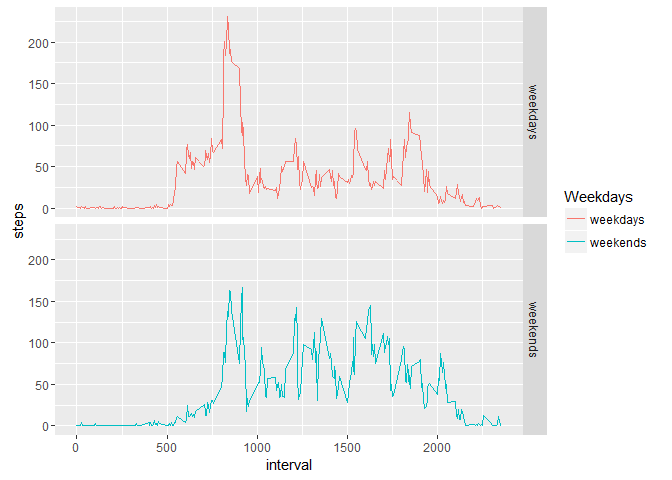

# Reproducible Research: Peer Assessment 1
Ingrid Qiu  
Friday, January 22, 2016  

This is the R markdaown file for the first assignment of Reproducible Research. In this assignment, we want to analyze the activity monitoring data of an individual. The dataset I am going to use counld be downloaded from <https://github.com/IngridQ/RepData_PeerAssessment1>.

##0. Loading and preprocessing the data

Before conducting the analysis, we need to load the dataset in R, and store it into activity. For the convenience of later analysis, I transform the class of date into the Date class and the class of steps into the numeric class.


```r
setwd('E:/online courses/reproducible research/assignment')
activity <- read.csv('activity.csv')
activity$date <- as.Date(activity$date)
activity$steps <- as.numeric(activity$steps)
```

##1. What is the mean total number of steps taken per day?

In the first part, we want to know the mean total number of steps taken per day. Since the information of steps is recorded every 5 minute, we first need to sum over steps by days, which could be done by aggregate(). 


```r
aggdata <- aggregate(activity[,-2],by =list(activity$date), FUN=sum,na.rm=TRUE)
names(aggdata) <- c("id","steps","min")
summary(aggdata$steps)
```

```
##    Min. 1st Qu.  Median    Mean 3rd Qu.    Max. 
##       0    6778   10400    9354   12810   21190
```

Then we can use the ggplot() function to draw the histogram of the total number of steps taken per day.


```r
library(ggplot2)
```

```
## Warning: package 'ggplot2' was built under R version 3.2.3
```

```r
h <- ggplot(aggdata,aes(x=steps))
h + geom_histogram(binwidth =1000, fill = "steelblue", colour = "black")
```

 

The following codes return the mean and median tatoal number of steps taken per day.


```r
mean_steps <- mean(aggdata$steps,na.rm=TRUE)
median_steps <- median(aggdata$steps,na.rm=TRUE)
print(paste("The mean total number of steps taken per day is",as.character(mean_steps),"steps."))
```

```
## [1] "The mean total number of steps taken per day is 9354.22950819672 steps."
```

```r
print(paste("The median total number of steps taken per day is",as.character(median_steps),"steps."))
```

```
## [1] "The median total number of steps taken per day is 10395 steps."
```

##2. What is the average daily activity pattern?

Then we want to know the average daily activity pattern. In order to depict the average daily activity pattern, we need to calculate the average stpes for each intercal in a day.


```r
agg_mean <- aggregate(activity[,-2],by = list(activity$interval), FUN=mean,na.rm=TRUE)
```

The figure plots the daily activity pattern on an average day.


```r
l <- ggplot(agg_mean,aes(x=interval,y=steps))
l + geom_line(color='steelblue')
```

 


```r
max_interval <- agg_mean$interval[which.max(agg_mean$steps)]
print(paste("The",as.character(max_interval),"th 5-minute interval contains the maximum number of steps."))
```

```
## [1] "The 835 th 5-minute interval contains the maximum number of steps."
```

##3. Imputing missing values
We have notice that there are some missing values in the steps variable. In the above analysis, we just ingore these missing values. However, this could cause bias to our analysis. Therefore, in this section, we are going to construct a new dataset with the missing values filled, based on the original dataset.

First, we construct a variable called step_na to record the missing values information. Then we count the total number of missing values.


```r
step_na <- is.na(activity$steps)
na_num <- sum(as.numeric(step_na))
print(paste("There are",as.character(na_num),"missing values in steps."))
```

```
## [1] "There are 2304 missing values in steps."
```

In a single day, people tend to have different amount of activity in different time intervals. So if we use the daily average steps to fill in the missing values, it would be inaccurate. Besides, in some days, it is possible that all values of steps are missing. If this is the case, then it is impossible to use the daily average steps to fill in the missing values. Therefore, I use the average daily activity pattern method. That is, if a value of steps is missing, then the average steps of the corresponding interval is used to fill in. 

To do this in R, I loop over 61 days and intervals. If the corresbonding value of steps is missing, which is indicated by step_na, then I replace this value with the average steps of the corresponding interval. 


```r
newdata <- cbind(activity,step_na)
summary(unclass(newdata$date))
```

```
##    Min. 1st Qu.  Median    Mean 3rd Qu.    Max. 
##   15610   15630   15640   15640   15660   15670
```

```r
for (i in 15614:15674){
  for (j in seq(0,2355,5)){
    newdata$steps[unclass(newdata$date)==i & newdata$interval==j & newdata$step_na[unclass(newdata$date)==i & newdata$interval==j]] = agg_mean$steps[agg_mean$interval==j]
  }
}
```

Then, as in the first step, we draw the histogram of steps using the newly constructed data.


```r
aggdata2 <- aggregate(newdata[,-4][,-2],by =list(newdata$date), FUN=sum,na.rm=TRUE)
h2 <- ggplot(aggdata2,aes(x=steps))
h2 + geom_histogram(binwidth =1000, fill = "steelblue", colour = "black")
```

 


```r
mean_steps2 <- mean(aggdata2$steps,na.rm=TRUE)
median_steps2 <- median(aggdata2$steps,na.rm=TRUE)
print(paste("The mean total number of steps taken per day is",as.character(mean_steps2),"steps."))
```

```
## [1] "The mean total number of steps taken per day is 10766.1886792453 steps."
```

```r
print(paste("The median total number of steps taken per day is",as.character(median_steps2),"steps."))
```

```
## [1] "The median total number of steps taken per day is 10766.1886792453 steps."
```

##4. Are there differences in activity patterns between weekdays and weekends?

In the last part, we want to know whether there is any difference in activity patterns between weekdays and weekends. Therefore, we need to seperate weekdays and weekends to analyze the activity patterns and then make a comparision.

First I construct an indicator variable to seperate weekends  and weekdays. Then I repeat the analysis in part 2.


```r
isweekends <- weekdays(activity$date)==weekdays(as.Date("2016-01-23"))|weekdays(activity$date)==weekdays(as.Date("2016-01-24"))
newdata2 <- cbind(newdata,isweekends)
agg_mean2 <- aggregate(newdata2[,-2],by = list(newdata2$interval,newdata2$isweekends), FUN=mean,na.rm=TRUE)
Weekdays <- agg_mean2$Group.2
Weekdays[agg_mean2$Group.2] <- "weekends"
Weekdays[!agg_mean2$Group.2] <- "weekdays"
agg_mean2 <- cbind(agg_mean2,Weekdays)
```

The plot shows that there is a difference in activity pattern between weekends and weekdays. On weekdays, there is an obvious peek in the amount of activity at about the 800th 5-minute interval. Then the amount of activity dimishes dramatically and slightly fluctuates. However, on weekends,  
the amount of activity tends to be more smooth on a typical day. This makes sense because people have to work on weekdays. During working hours, they have to sit down and finish the tasks assigned to them, which means they cannot have intensive activity in these time intervals. However, since time are more flexible at weekends, activity is likely to be smoothed over a day.

```r
l2 <- ggplot(agg_mean2,aes(x=interval,y=steps,color=Weekdays))
l2 + geom_line() + facet_grid(Weekdays ~ .)
```

 


